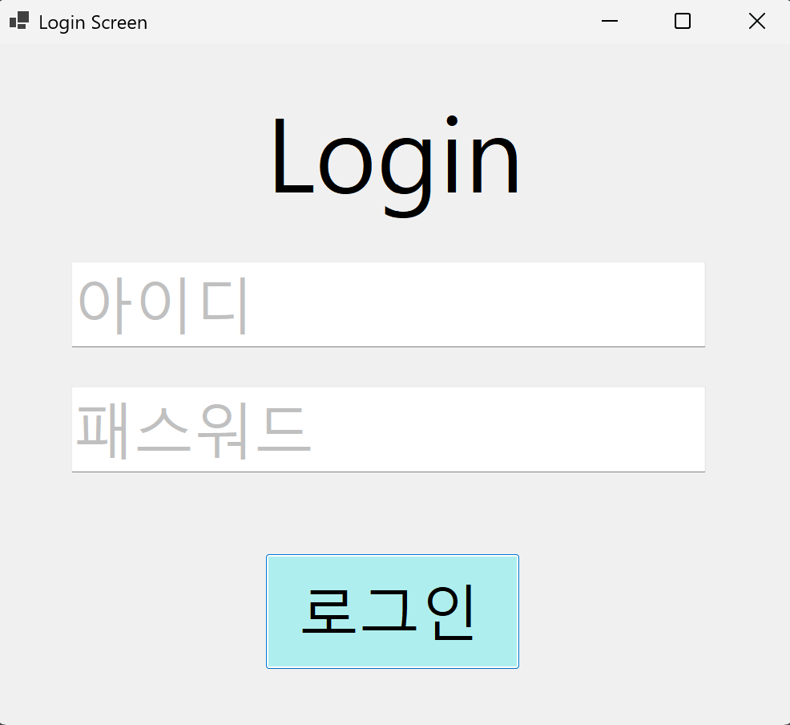
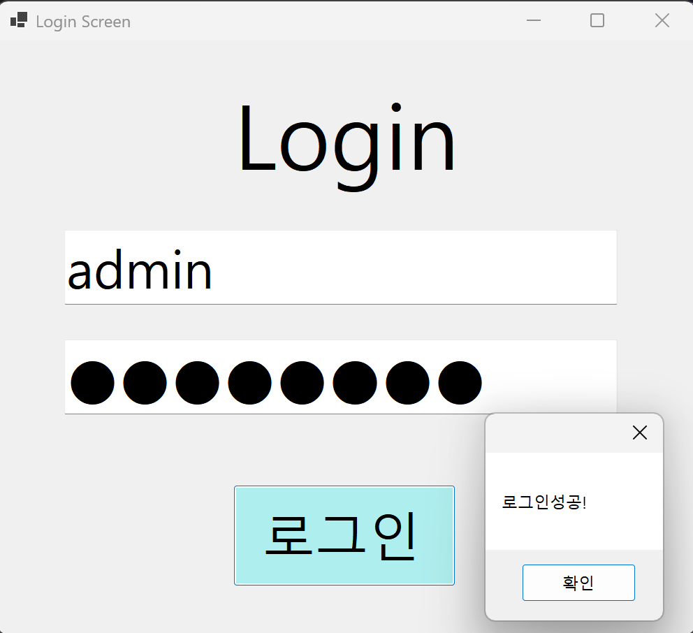
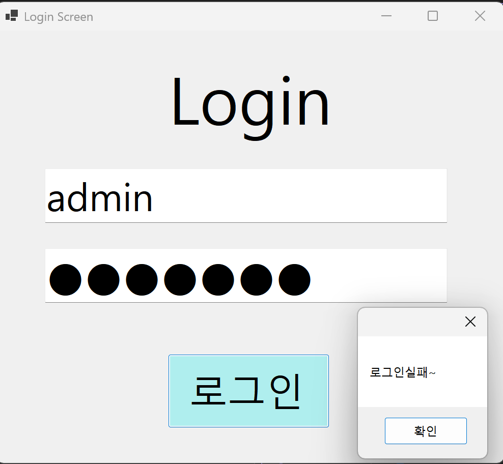

# (C# 코딩) 로그인 스크린

## 개요
- C# 프로그래밍 학습
- 1줄 소개: 사용자의 아이디와 패스워드를 검증하여 접근 권한을 관리하는 상황별 판단 시스템입니다.
- 사용한 플랫폼:
  - C#, .NET Windows Forms, Visual Studio, GitHub
- 사용한 컨트롤:
  - Label, TextBox, Button
- 사용한 기술과 구현한 기능:
  - If~else 조건문과 비교 연산자를 활용한 로그인 인증 로직
  - Placeholder 기능 구현
  - Enter 및 Leave 이벤트를 활용한 Placeholder(힌트 텍스트) 구현
  - KeyDown 이벤트를 활용한 Enter 키 포커스 이동 및 PerformClick() 제어
  - UseSystemPasswordChar 속성을 이용한 패스워드 마스킹 보안 처리
  - Visible 속성을 활용한 동적 에러 메시지 출력 제어

## 실행 화면 (과제1)
- 과제1 코드의 실행 스크린샷

  
- 
- 
- 

- 과제 내용:
  - Label(제목), TextBox(아이디, 패스워드), Button(로그인)을 적절히 배치하여 로그인 화면의 외형을 디자인합니다.
  - 아이디와 패스워드 일치 여부를 판단하여 로그인 성공/실패 메시지 박스 출력 기능을 구현합니다.
  - 패스워드 입력 시 내용이 보이지 않도록 마스킹 처리하여 보안성을 높입니다.
  - 상황에 적합한 MessageBox 아이콘과 버튼을 활용해 결과를 알립니다.

- 구현 내용과 기능 설명:
  - Windows Forms의 기초적인 컨트롤 배치를 통해 로그인 시스템의 기본 외형을 완성했습니다. 논리 연산자(&&)를 사용하여 아이디와 비밀번호가 모두 지정된 값과 일치할 때만 성공 피드백을 제공하는 이중 검증 로직을 구축했습니다. 아이디와 패스워드 입력창에는 초기 안내 문구가 표시되도록 하여 사용자 편의성을 고려했습니다.

- 사용한 기술과 구현한 기능:
  - 문자열 비교(==)를 통한 사용자 입력 데이터 검증 기술
  - MessageBoxButtons 및 MessageBoxIcon을 활용한 상황별 알림 최적화
  - UseSystemPasswordChar 속성을 이용한 패스워드 보안 처리 

