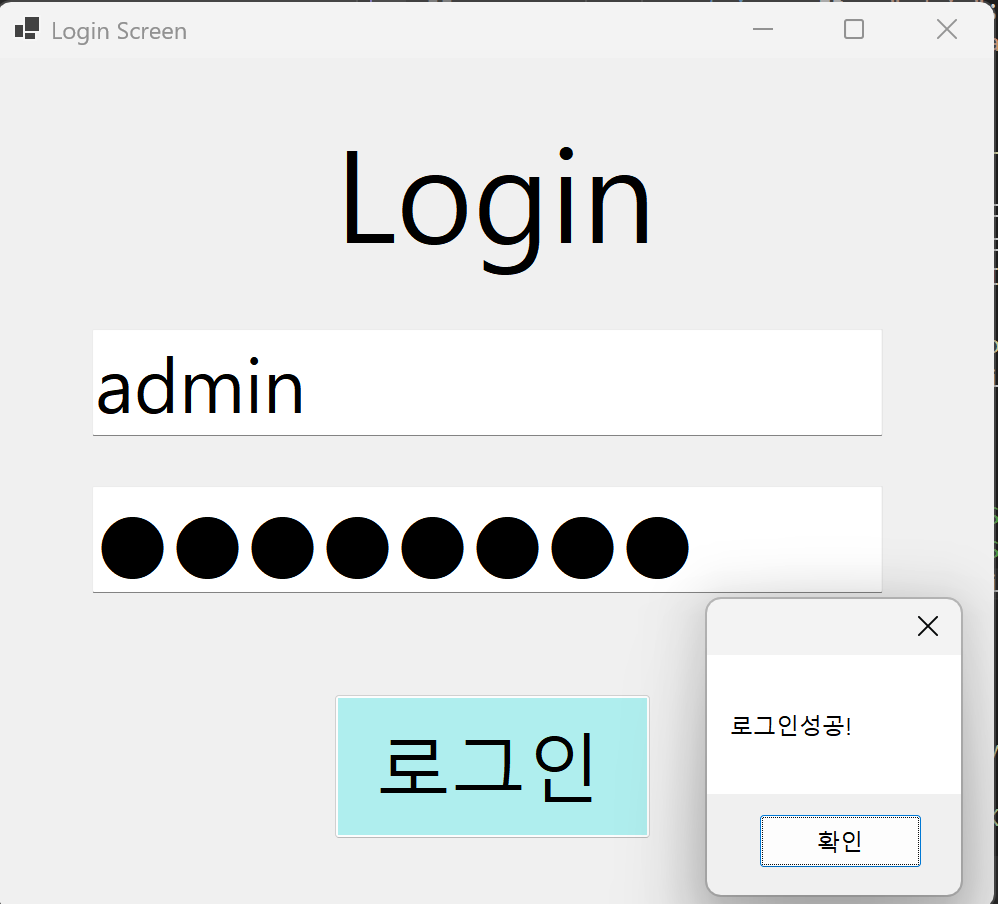
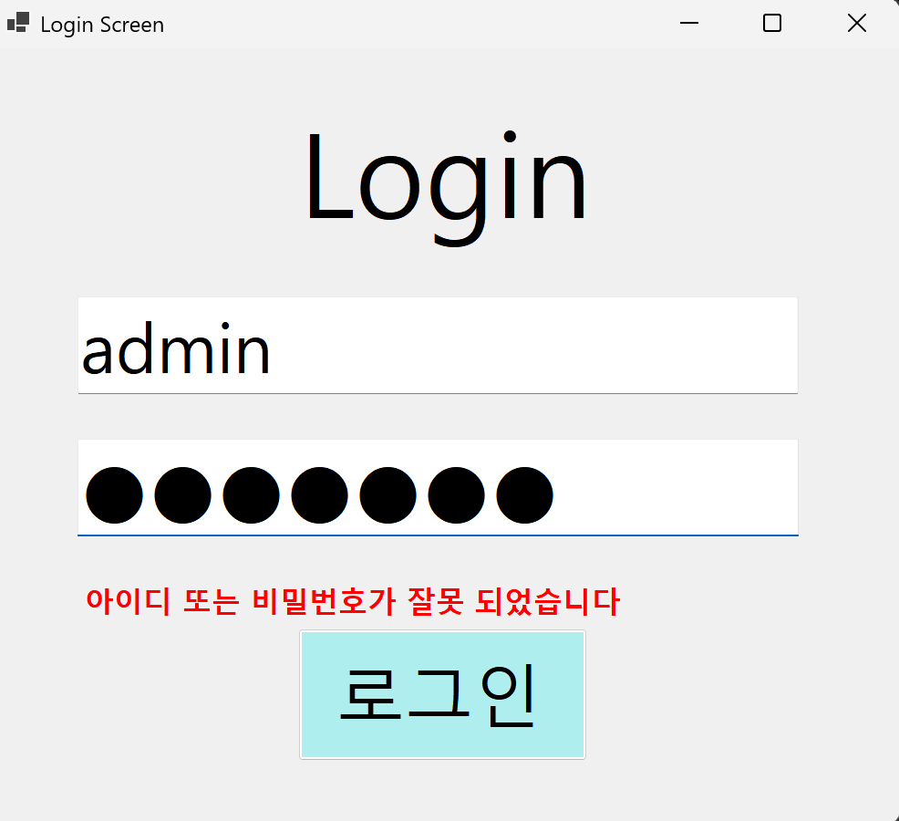

# (C# 코딩) 로그인 스크린

## 개요
- C# 프로그래밍 학습
- 1줄 소개: 사용자의 아이디와 패스워드를 검증하여 접근 권한을 관리하는 상황별 판단 시스템입니다.
- 사용한 플랫폼:
  - C#, .NET Windows Forms, Visual Studio, GitHub
- 사용한 컨트롤:
  - Label, TextBox, Button
- 사용한 기술과 구현한 기능:
  - If~else 조건문과 비교 연산자를 활용한 로그인 인증 로직
  - Placeholder 기능 구현
  - Enter 및 Leave 이벤트를 활용한 Placeholder(힌트 텍스트) 구현
  - KeyDown 이벤트를 활용한 Enter 키 포커스 이동 및 PerformClick() 제어
  - UseSystemPasswordChar 속성을 이용한 패스워드 마스킹 보안 처리
  - Visible 속성을 활용한 동적 에러 메시지 출력 제어

## 실행 화면 (과제1)
- 과제1 코드의 실행 스크린샷

  
- 
- 
- 

- 과제 내용:
  - Label(제목), TextBox(아이디, 패스워드), Button(로그인)을 적절히 배치하여 로그인 화면의 외형을 디자인합니다.
  - 아이디와 패스워드 일치 여부를 판단하여 로그인 성공/실패 메시지 박스 출력 기능을 구현합니다.
  - 패스워드 입력 시 내용이 보이지 않도록 마스킹 처리하여 보안성을 높입니다.
  - 상황에 적합한 MessageBox 아이콘과 버튼을 활용해 결과를 알립니다.

- 구현 내용과 기능 설명:
  - Windows Forms의 기초적인 컨트롤 배치를 통해 로그인 시스템의 기본 외형을 완성했습니다. 논리 연산자(&&)를 사용하여 아이디와 비밀번호가 모두 지정된 값과 일치할 때만 성공 피드백을 제공하는 이중 검증 로직을 구축했습니다. 아이디와 패스워드 입력창에는 초기 안내 문구가 표시되도록 하여 사용자 편의성을 고려했습니다.

- 사용한 기술과 구현한 기능:
  - 문자열 비교(==)를 통한 사용자 입력 데이터 검증 기술
  - MessageBoxButtons 및 MessageBoxIcon을 활용한 상황별 알림 최적화
  - UseSystemPasswordChar 속성을 이용한 패스워드 보안 처리 

  ## 실행 화면 (과제2)
- 과제2 코드의 실행 스크린샷

  
- 
- 

- 과제 내용:
  - 로그인 실패 시 사용자 흐름을 끊는 팝업 창(MessageBox) 대신, 메인 화면 내에서 에러 메시지를 즉각적으로 확인할 수 있도록 레이블을 배치합니다 .
  - Visible 속성을 이용하여 상황에 따라 메시지를 보이기/숨기기 처리합니다.
  - 사용자에게 현재 입력 상태의 오류를 시각적으로 명확하게 전달하는 것을 목표로 합니다.

- 구현 내용과 기능 설명:
  - 별도의 확인 버튼을 눌러 창을 닫아야 하는 번거로움을 제거하기 위해, ID/PW 입력창 하단에 에러 전용 레이블(lblErrorMsg)을 추가했습니다.
  - 프로그램 시작 시에는 에러 메시지가 보이지 않도록 Visible 속성을 false로 설정하여 깨끗한 인터페이스를 유지합니다.
  - 로그인 버튼 클릭 시 실행되는 if~else 문 내에서, 인증 실패 시에만 lblErrorMsg.Visible = true; 코드가 실행되도록 설계하여 실시간 피드백을 구현했습니다 .

 - 사용한 기술과 구현한 기능:
  - 런타임 중에 특정 컨트롤의 존재 여부를 제어하여 사용자에게 필요한 정보만 선별적으로 노출하는 기술을 습득했습니다.
  - 에러 메시지의 텍스트 색상을 Red로 지정하여, 사용자가 본인의 입력 오류를 직관적으로 인지할 수 있도록 디자인 요소를 강화했습니다.
  - 기존의 단순 메시지 출력 방식에서 벗어나 UI 컨트롤의 속성을 직접 조작하는 실무형 핸들링 방식을 적용했습니다. 
